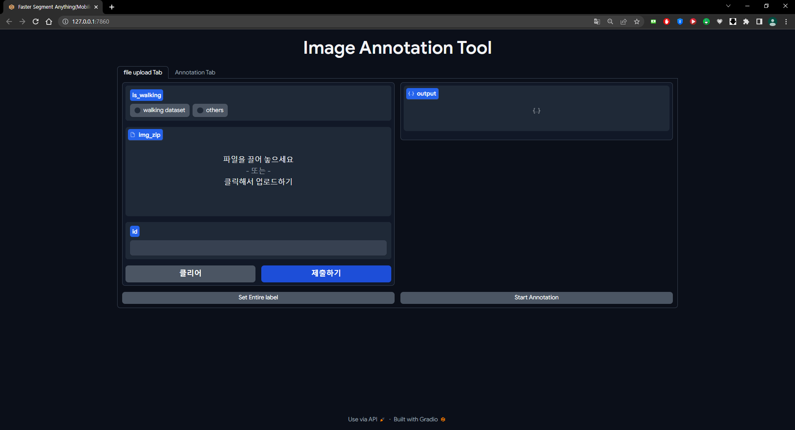
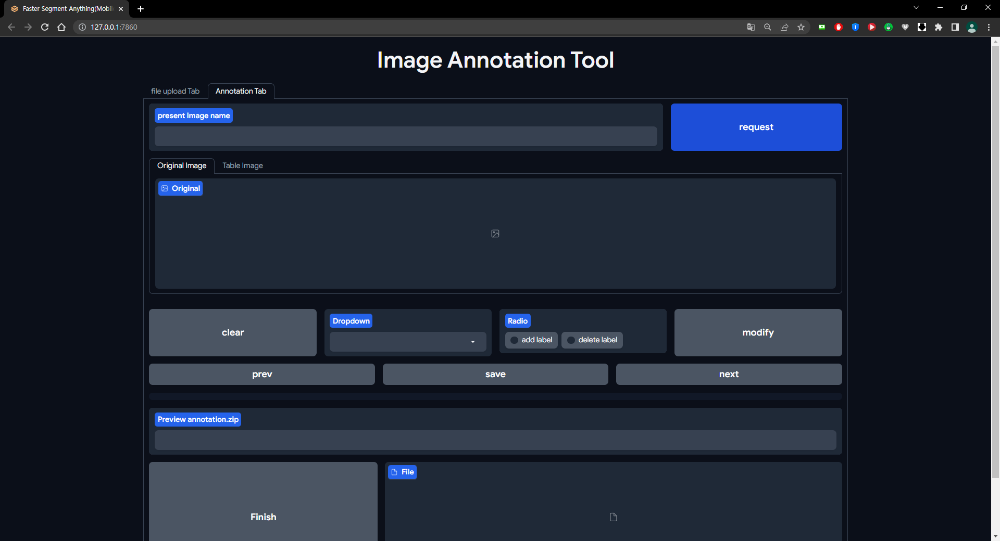

# Data Annotation Tool - FE(Gradio) Server

## 1. Install requirements

```
pip install -r requirements.txt
```

## 2. run `app.py`

```
gradio run app.py
```

if you run `app.py` externel server

```
# in app.py, fixed last line code
demo.launch(server_name="0.0.0.0", server_port=your port)
```

## 3. Just use the tool



1. check dataset type (Currently only walking dataset is supported)
2. Upload your image.zip file
3. Input your ID
4. Click "제출하기" Button
   (you can see file list in zip file)
5. Click "Set Entire label", "Start Annotation"
6. Go to the Annotation Tab



1. You can see Original image first. To get psuedo label, click request button
2. You can get the psuedo labelling image in Table Image tab
3. If you want to modify the label
   You can check "Add Label", select a label from the drop-down, click the part you want to change in the image, and press modify.
4. You can move to the next image or the previous image using the prev button and the next button.
5. If you want to save the annotation of the current image, press the save button.
6. If you want to finish annotation and download the entire annotation file, press the Finish button.
